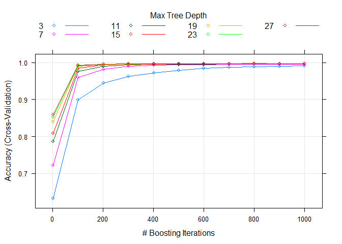
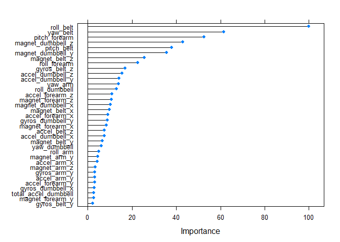

# Machine Learning-Based Estimation of Weight Lifting Exercise Form
Peter F. Symosek  
October 03, 2016  


## Executive Summary
Traditional ergonomic measurement systems such as the Nike FuelBand, the Garmin Vivofit or the Fitbit are efficient at distinguishing generic levels of activity such as active vs. inactive or jogging vs. walking, but have not been utilized to qualitatively estimate the form of those activities. The Pontifical Catholic University of Rio de Janeiro is carrying out research for the effectiveness of these devices for qualitative estimation of exercise form [1]. In this project, the researchers deployed accelerometers on the belt, forearm, arm, and dumbell of 6 participants. They were asked to perform barbell lifts correctly and incorrectly in 5 different ways. The purpose of this report is to estimate how well a standard machine learning algorithm can distinguish between the forms.

Six young health participants were asked to perform one set of 10 repetitions of the Unilateral Dumbbell Biceps Curl in five different fashions: exactly according to the specification (Class A), throwing the elbows to the front (Class B), lifting the dumbbell only halfway (Class C), lowering the dumbbell only halfway (Class D) and throwing the hips to the front (Class E). Class A corresponds to the specified execution of the exercise, while the other 4 classes correspond to common mistakes [2]. 

## Data Analysis

The Weight Lifting Exercise dataset is derived from the public domain dataset stored at the webpage http://groupware.les.inf.puc-rio.br/har. The dataset is retrived and checked for tidyness. A rapid scan of the first few elements of the training data demonstrates that there are several variables which are primarily comprised of NA's. A helper routine, delete_na.R, was written to delete the bad data. The first seven columns of the training data are discarded as well because they have no relevance for HAR. The first seven and last columns of the testing data are discarded as well. After reducing the datasets to variables that are relevant to classification of the exercise form, there are 86 columns for the training data and 52 columns for the testing data.

```r
trainfileURL<-"https://d396qusza40orc.cloudfront.net/predmachlearn/pml-training.csv"
testfileURL<-"https://d396qusza40orc.cloudfront.net/predmachlearn/pml-testing.csv"
training<-read.csv(trainfileURL)
testing<-read.csv(testfileURL)
```


```r
str(training,vec.len=1,list.len=20)
```

```
## 'data.frame':	19622 obs. of  160 variables:
##  $ X                       : int  1 2 ...
##  $ user_name               : Factor w/ 6 levels "adelmo","carlitos",..: 2 2 ...
##  $ raw_timestamp_part_1    : int  1323084231 1323084231 ...
##  $ raw_timestamp_part_2    : int  788290 808298 ...
##  $ cvtd_timestamp          : Factor w/ 20 levels "02/12/2011 13:32",..: 9 9 ...
##  $ new_window              : Factor w/ 2 levels "no","yes": 1 1 ...
##  $ num_window              : int  11 11 ...
##  $ roll_belt               : num  1.41 1.41 ...
##  $ pitch_belt              : num  8.07 8.07 ...
##  $ yaw_belt                : num  -94.4 -94.4 ...
##  $ total_accel_belt        : int  3 3 ...
##  $ kurtosis_roll_belt      : Factor w/ 397 levels "","-0.016850",..: 1 1 ...
##  $ kurtosis_picth_belt     : Factor w/ 317 levels "","-0.021887",..: 1 1 ...
##  $ kurtosis_yaw_belt       : Factor w/ 2 levels "","#DIV/0!": 1 1 ...
##  $ skewness_roll_belt      : Factor w/ 395 levels "","-0.003095",..: 1 1 ...
##  $ skewness_roll_belt.1    : Factor w/ 338 levels "","-0.005928",..: 1 1 ...
##  $ skewness_yaw_belt       : Factor w/ 2 levels "","#DIV/0!": 1 1 ...
##  $ max_roll_belt           : num  NA NA ...
##  $ max_picth_belt          : int  NA NA ...
##  $ max_yaw_belt            : Factor w/ 68 levels "","-0.1","-0.2",..: 1 1 ...
##   [list output truncated]
```

```r
str(testing,vec.len=1,list.len=20)
```

```
## 'data.frame':	20 obs. of  160 variables:
##  $ X                       : int  1 2 ...
##  $ user_name               : Factor w/ 6 levels "adelmo","carlitos",..: 6 5 ...
##  $ raw_timestamp_part_1    : int  1323095002 1322673067 ...
##  $ raw_timestamp_part_2    : int  868349 778725 ...
##  $ cvtd_timestamp          : Factor w/ 11 levels "02/12/2011 13:33",..: 5 10 ...
##  $ new_window              : Factor w/ 1 level "no": 1 1 ...
##  $ num_window              : int  74 431 ...
##  $ roll_belt               : num  123 1.02 ...
##  $ pitch_belt              : num  27 4.87 ...
##  $ yaw_belt                : num  -4.75 -88.9 ...
##  $ total_accel_belt        : int  20 4 ...
##  $ kurtosis_roll_belt      : logi  NA ...
##  $ kurtosis_picth_belt     : logi  NA ...
##  $ kurtosis_yaw_belt       : logi  NA ...
##  $ skewness_roll_belt      : logi  NA ...
##  $ skewness_roll_belt.1    : logi  NA ...
##  $ skewness_yaw_belt       : logi  NA ...
##  $ max_roll_belt           : logi  NA ...
##  $ max_picth_belt          : logi  NA ...
##  $ max_yaw_belt            : logi  NA ...
##   [list output truncated]
```

Because the ultimate objective of training is to classify the samples of the testing dataset with high accuracy, the training dataset variables are restricted to those variables that exist in the testing data. A utility function, calculate_both.R, is written to accomplish this. The category identification variable, "classe", of the training dataset is concatenated to the right side of the data frame after downselection to the variables that are found in both the training and the testing datasets. After this calculation, there are 53 columns in the resultant dataset (all of the testing dataset variables occurred in the training dataset).

```r
delete_na <- function (df) {
    result <- df
    for( i in seq(ncol(df),1,-1) ) {
        if( sum(is.na(df[,i])) > 0 ) {
            result <- result[,-i]
        }
    }
    result
}
trainsub<-delete_na(training[,-(1:7)])
testsub<-delete_na(testing[,-(c(1:7,160))])
dim(trainsub)
```

```
## [1] 19622    86
```

```r
dim(testsub)
```

```
## [1] 20 52
```

```r
names(trainsub[,1:15])
```

```
##  [1] "roll_belt"            "pitch_belt"           "yaw_belt"            
##  [4] "total_accel_belt"     "kurtosis_roll_belt"   "kurtosis_picth_belt" 
##  [7] "kurtosis_yaw_belt"    "skewness_roll_belt"   "skewness_roll_belt.1"
## [10] "skewness_yaw_belt"    "max_yaw_belt"         "min_yaw_belt"        
## [13] "amplitude_yaw_belt"   "gyros_belt_x"         "gyros_belt_y"
```

```r
names(testsub[,1:15])
```

```
##  [1] "roll_belt"        "pitch_belt"       "yaw_belt"        
##  [4] "total_accel_belt" "gyros_belt_x"     "gyros_belt_y"    
##  [7] "gyros_belt_z"     "accel_belt_x"     "accel_belt_y"    
## [10] "accel_belt_z"     "magnet_belt_x"    "magnet_belt_y"   
## [13] "magnet_belt_z"    "roll_arm"         "pitch_arm"
```

```r
calculate_both <- function(trr,ter) {
    trrb <- NULL
    for( i in names(trr)) {
        if(length(intersect(i,names(ter)))>0) {
            trrb<-cbind(trrb,trr[,i])
        }
    }
    trrb <- cbind(trrb,trr[,ncol(trr)])
    trrb <- as.data.frame(trrb)
    names(trrb) <- c(names(ter), 'classe')
    trrb[,(ncol(ter)+1)] <- as.factor(trrb[,(ncol(ter)+1)])
    trrb
}
trainsubr<-calculate_both(trainsub,testsub)
dim(trainsubr)
```

```
## [1] 19622    53
```

Velloso, et al [2] used a Random Forest classifier to attain a 98.2% correct classification rate. The authors also used "bagging" or bootstrap aggregating to augment the performance of a single Random Forest classifier, where bootstrap aggregating averages together the classification decisions of an array of weak classifiers to obtain a more robust classifier. Stochastic Gradient Boosting can also be used to improve the performance of individual tree classifiers where boosting calculates a weighted average of the classication decisions of an array of weak classifiers to obtain a better classifier. The weights of the weighted average are derived using optimal estimators [3]. 

The training dataset after downselection is partitioned into a training subset and a testing subset with the createDataPartition routine of the caret library. The subsets are selected with the training subset percentage = 75% and the testing subset percentage = 25%. The Gradient Boosting Model (gbm) classifier is trained using the train routine of the caret library. Training is carried out with cross validation with 10 folds. The training is configured to execute in parallel using the parallel and doParallel libraries. The learning rate (shrinkage) is 0.05. The maximum depth of interactions (interaction.depth) is identified as a grid of seq(3,27,4) variable interactions. The total number of trees to fit (n.trees) is defined as a grid of seq(1,1001,100). This is equivalent to the number of iterations and the number of basis functions in the additive expansion. The minimum number of observations in the trees' terminal nodes (n.minobsinnode) is specified to be 15.

```r
library(caret)
set.seed(95014)
library(parallel)
library(doParallel)
cluster <- makeCluster(detectCores() - 1) # convention to leave 1 core for OS
registerDoParallel(cluster)
fitControl <- trainControl(method = "cv",
                           number = 10,
                           allowParallel = TRUE)
inTraining <- createDataPartition(trainsubr[,53], p = .75, list=FALSE)
traindata <- trainsubr[inTraining,]
testdata <- trainsubr[-inTraining,]
myTuningGrid <- expand.grid(n.trees=seq(1,1001,100),interaction.depth=seq(3,27,4),
           n.minobsinnode=15,shrinkage=0.05)
x <- traindata[,-53]
y <- traindata[,53]
fitgbm <- train(x=x,y=y,method="gbm",trControl=fitControl,tuneGrid=myTuningGrid,
                verbose=FALSE)
stopCluster(cluster)
```

```r
plot(fitgbm)
```

<!-- -->

Figure 1. Classification Accuracy for Stochastic Gradient Boosting


```r
fitgbm$finalModel
```

```
## A gradient boosted model with multinomial loss function.
## 801 iterations were performed.
## There were 52 predictors of which 52 had non-zero influence.
```

```r
fitgbm$bestTune
```

```
##    n.trees interaction.depth shrinkage n.minobsinnode
## 53     801                19      0.05             15
```

```r
confusionMatrix(predict(fitgbm,testdata[,-53]),testdata$classe)
```

```
## Confusion Matrix and Statistics
## 
##           Reference
## Prediction    1    2    3    4    5
##          1 1394    3    0    0    0
##          2    1  942    1    0    0
##          3    0    4  852    2    0
##          4    0    0    2  802    3
##          5    0    0    0    0  898
## 
## Overall Statistics
##                                           
##                Accuracy : 0.9967          
##                  95% CI : (0.9947, 0.9981)
##     No Information Rate : 0.2845          
##     P-Value [Acc > NIR] : < 2.2e-16       
##                                           
##                   Kappa : 0.9959          
##  Mcnemar's Test P-Value : NA              
## 
## Statistics by Class:
## 
##                      Class: 1 Class: 2 Class: 3 Class: 4 Class: 5
## Sensitivity            0.9993   0.9926   0.9965   0.9975   0.9967
## Specificity            0.9991   0.9995   0.9985   0.9988   1.0000
## Pos Pred Value         0.9979   0.9979   0.9930   0.9938   1.0000
## Neg Pred Value         0.9997   0.9982   0.9993   0.9995   0.9993
## Prevalence             0.2845   0.1935   0.1743   0.1639   0.1837
## Detection Rate         0.2843   0.1921   0.1737   0.1635   0.1831
## Detection Prevalence   0.2849   0.1925   0.1750   0.1646   0.1831
## Balanced Accuracy      0.9992   0.9961   0.9975   0.9981   0.9983
```
The trained classifier's performance as a function of the total number of trees and interaction depth is shown in Figure 1. For interaction depths greater than or equal to seven and the number of trees greater than 400, the classifier's accuracy is 99% or greater. The best configuration is number of trees = 801 and interaction depth = 19. The importance of the training variables is shown in Figure 2.

```r
plot(varImp(fitgbm),top=35)
```

<!-- -->

Figure 2. Variable Importance for Stochastic Gradient Boosting

The estimated exercise categories for the testing dataset are shown in Table 1.


```r
data.frame(problem_id=testing$problem_id,classe=predict(fitgbm,testsub[,-53]))
```

```
##    problem_id classe
## 1           1      2
## 2           2      1
## 3           3      2
## 4           4      1
## 5           5      1
## 6           6      5
## 7           7      4
## 8           8      2
## 9           9      1
## 10         10      1
## 11         11      2
## 12         12      3
## 13         13      2
## 14         14      1
## 15         15      5
## 16         16      5
## 17         17      1
## 18         18      2
## 19         19      2
## 20         20      2
```
Table 1. Testing Dataset Categories

## Conclusions

The cross-validation classification rate of the Gradient Boosting Model is 99.67%. This improvement is attained by use of a significantly more complex classifier which required several hours of training time on a laptop computer.


## Bibliography

1. Human Activity Recognition, http://groupware.les.inf.puc-rio.br/har, retrieved 10/03/2016

2. Velloso, E.; Bulling, A.; Gellersen, H.; Ugulino, W.; Fuks, H. Qualitative Activity Recognition of Weight Lifting Exercises. Proceedings of 4th International Conference in Cooperation with SIGCHI (Augmented Human '13) . Stuttgart, Germany: ACM SIGCHI, 2013.

3. Package 'gbm', https://cran.r-project.org/web/packages/gbm/gbm.pdf, retrieved 10/03/2016
