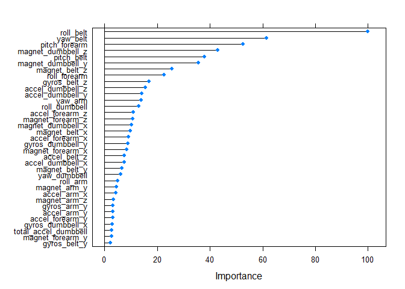

# Untitled
Peter F. Symosek  
September 28, 2016  


## Executive Summary
Using devices such as Jawbone Up, Nike FuelBand, and Fitbit it is now possible to collect a large amount of data about personal activity relatively inexpensively. These type of devices are part of the quantified self movement – a group of enthusiasts who take measurements about themselves regularly to improve their health, to find patterns in their behavior, or because they are tech geeks. One thing that people regularly do is quantify how much of a particular activity they do, but they rarely quantify how well they do it. In this project, your goal will be to use data from accelerometers on the belt, forearm, arm, and dumbell of 6 participants. They were asked to perform barbell lifts correctly and incorrectly in 5 different ways. More information is available from the website here: http://groupware.les.inf.puc-rio.br/har (see the section on the Weight Lifting Exercise Dataset). 

Weight Lifting Exercises Dataset


On-body sensing schema


This human activity recognition research has traditionally focused on discriminating between different activities, i.e. to predict "which" activity was performed at a specific point in time (like with the Daily Living Activities dataset above). The approach we propose for the Weight Lifting Exercises dataset is to investigate "how (well)" an activity was performed by the wearer. The "how (well)" investigation has only received little attention so far, even though it potentially provides useful information for a large variety of applications,such as sports training.

In this work (see the paper) we first define quality of execution and investigate three aspects that pertain to qualitative activity recognition: the problem of specifying correct execution, the automatic and robust detection of execution mistakes, and how to provide feedback on the quality of execution to the user. We tried out an on-body sensing approach (dataset here), but also an "ambient sensing approach" (by using Microsoft Kinect - dataset still unavailable)

Six young health participants were asked to perform one set of 10 repetitions of the Unilateral Dumbbell Biceps Curl in five different fashions: exactly according to the specification (Class A), throwing the elbows to the front (Class B), lifting the dumbbell only halfway (Class C), lowering the dumbbell only halfway (Class D) and throwing the hips to the front (Class E).

Class A corresponds to the specified execution of the exercise, while the other 4 classes correspond to common mistakes. Participants were supervised by an experienced weight lifter to make sure the execution complied to the manner they were supposed to simulate. The exercises were performed by six male participants aged between 20-28 years, with little weight lifting experience. We made sure that all participants could easily simulate the mistakes in a safe and controlled manner by using a relatively light dumbbell (1.25kg).

The goal of your project is to predict the manner in which they did the exercise. This is the "classe" variable in the training set. You may use any of the other variables to predict with. You should create a report describing how you built your model, how you used cross validation, what you think the expected out of sample error is, and why you made the choices you did. You will also use your prediction model to predict 20 different test cases.


```r
trainfileURL<-"https://d396qusza40orc.cloudfront.net/predmachlearn/pml-training.csv"
testfileURL<-"https://d396qusza40orc.cloudfront.net/predmachlearn/pml-testing.csv"
training<-read.csv(trainfileURL)
testing<-read.csv(testfileURL)
```
## Data Analysis

```r
str(training,vec.len=1,list.len=20)
```

```
## 'data.frame':	19622 obs. of  160 variables:
##  $ X                       : int  1 2 ...
##  $ user_name               : Factor w/ 6 levels "adelmo","carlitos",..: 2 2 ...
##  $ raw_timestamp_part_1    : int  1323084231 1323084231 ...
##  $ raw_timestamp_part_2    : int  788290 808298 ...
##  $ cvtd_timestamp          : Factor w/ 20 levels "02/12/2011 13:32",..: 9 9 ...
##  $ new_window              : Factor w/ 2 levels "no","yes": 1 1 ...
##  $ num_window              : int  11 11 ...
##  $ roll_belt               : num  1.41 1.41 ...
##  $ pitch_belt              : num  8.07 8.07 ...
##  $ yaw_belt                : num  -94.4 -94.4 ...
##  $ total_accel_belt        : int  3 3 ...
##  $ kurtosis_roll_belt      : Factor w/ 397 levels "","-0.016850",..: 1 1 ...
##  $ kurtosis_picth_belt     : Factor w/ 317 levels "","-0.021887",..: 1 1 ...
##  $ kurtosis_yaw_belt       : Factor w/ 2 levels "","#DIV/0!": 1 1 ...
##  $ skewness_roll_belt      : Factor w/ 395 levels "","-0.003095",..: 1 1 ...
##  $ skewness_roll_belt.1    : Factor w/ 338 levels "","-0.005928",..: 1 1 ...
##  $ skewness_yaw_belt       : Factor w/ 2 levels "","#DIV/0!": 1 1 ...
##  $ max_roll_belt           : num  NA NA ...
##  $ max_picth_belt          : int  NA NA ...
##  $ max_yaw_belt            : Factor w/ 68 levels "","-0.1","-0.2",..: 1 1 ...
##   [list output truncated]
```

```r
str(testing,vec.len=1,list.len=20)
```

```
## 'data.frame':	20 obs. of  160 variables:
##  $ X                       : int  1 2 ...
##  $ user_name               : Factor w/ 6 levels "adelmo","carlitos",..: 6 5 ...
##  $ raw_timestamp_part_1    : int  1323095002 1322673067 ...
##  $ raw_timestamp_part_2    : int  868349 778725 ...
##  $ cvtd_timestamp          : Factor w/ 11 levels "02/12/2011 13:33",..: 5 10 ...
##  $ new_window              : Factor w/ 1 level "no": 1 1 ...
##  $ num_window              : int  74 431 ...
##  $ roll_belt               : num  123 1.02 ...
##  $ pitch_belt              : num  27 4.87 ...
##  $ yaw_belt                : num  -4.75 -88.9 ...
##  $ total_accel_belt        : int  20 4 ...
##  $ kurtosis_roll_belt      : logi  NA ...
##  $ kurtosis_picth_belt     : logi  NA ...
##  $ kurtosis_yaw_belt       : logi  NA ...
##  $ skewness_roll_belt      : logi  NA ...
##  $ skewness_roll_belt.1    : logi  NA ...
##  $ skewness_yaw_belt       : logi  NA ...
##  $ max_roll_belt           : logi  NA ...
##  $ max_picth_belt          : logi  NA ...
##  $ max_yaw_belt            : logi  NA ...
##   [list output truncated]
```

```r
delete_na <- function (df) {
    result <- df
    for( i in seq(ncol(df),1,-1) ) {
        if( sum(is.na(df[,i])) > 0 ) {
            result <- result[,-i]
        }
    }
    result
}
trainsub<-delete_na(training[,-(1:7)])
testsub<-delete_na(testing[,-(c(1:7,160))])
dim(trainsub)
```

```
## [1] 19622    86
```

```r
dim(testsub)
```

```
## [1] 20 52
```

```r
names(trainsub[,1:15])
```

```
##  [1] "roll_belt"            "pitch_belt"           "yaw_belt"            
##  [4] "total_accel_belt"     "kurtosis_roll_belt"   "kurtosis_picth_belt" 
##  [7] "kurtosis_yaw_belt"    "skewness_roll_belt"   "skewness_roll_belt.1"
## [10] "skewness_yaw_belt"    "max_yaw_belt"         "min_yaw_belt"        
## [13] "amplitude_yaw_belt"   "gyros_belt_x"         "gyros_belt_y"
```

```r
names(testsub[,1:15])
```

```
##  [1] "roll_belt"        "pitch_belt"       "yaw_belt"        
##  [4] "total_accel_belt" "gyros_belt_x"     "gyros_belt_y"    
##  [7] "gyros_belt_z"     "accel_belt_x"     "accel_belt_y"    
## [10] "accel_belt_z"     "magnet_belt_x"    "magnet_belt_y"   
## [13] "magnet_belt_z"    "roll_arm"         "pitch_arm"
```

```r
calculate_both <- function(trr,ter) {
    trrb <- NULL
    for( i in names(trr)) {
        if(length(intersect(i,names(ter)))>0) {
            trrb<-cbind(trrb,trr[,i])
        }
    }
    trrb <- cbind(trrb,trr[,ncol(trr)])
    trrb <- as.data.frame(trrb)
    names(trrb) <- c(names(ter), 'classe')
    trrb[,(ncol(ter)+1)] <- as.factor(trrb[,(ncol(ter)+1)])
    trrb
}
trainsubr<-calculate_both(trainsub,testsub)
dim(trainsubr)
```

```
## [1] 19622    53
```

```r
library(caret)
set.seed(95014)
library(parallel)
library(doParallel)
cluster <- makeCluster(detectCores() - 1) # convention to leave 1 core for OS
registerDoParallel(cluster)
fitControl <- trainControl(method = "cv",
                           number = 10,
                           allowParallel = TRUE)
inTraining <- createDataPartition(trainsubr[,53], p = .75, list=FALSE)
traindata <- trainsubr[inTraining,]
testdata <- trainsubr[-inTraining,]
myTuningGrid <- expand.grid(n.trees=seq(1,1001,100),interaction.depth=seq(3,27,4),
           n.minobsinnode=15,shrinkage=0.05)
x <- traindata[,-53]
y <- traindata[,53]
fitgbm <- train(x=x,y=y,method="gbm",trControl=fitControl,tuneGrid=myTuningGrid,
                verbose=FALSE)
stopCluster(cluster)
```

```r
plot(fitgbm)
```

<!-- -->

```r
fitgbm$finalModel
```

```
## A gradient boosted model with multinomial loss function.
## 801 iterations were performed.
## There were 52 predictors of which 52 had non-zero influence.
```

```r
fitgbm$bestTune
```

```
##    n.trees interaction.depth shrinkage n.minobsinnode
## 53     801                19      0.05             15
```

```r
confusionMatrix(predict(fitgbm,testdata[,-53]),testdata$classe)
```

```
## Confusion Matrix and Statistics
## 
##           Reference
## Prediction    1    2    3    4    5
##          1 1394    3    0    0    0
##          2    1  942    1    0    0
##          3    0    4  852    2    0
##          4    0    0    2  802    3
##          5    0    0    0    0  898
## 
## Overall Statistics
##                                           
##                Accuracy : 0.9967          
##                  95% CI : (0.9947, 0.9981)
##     No Information Rate : 0.2845          
##     P-Value [Acc > NIR] : < 2.2e-16       
##                                           
##                   Kappa : 0.9959          
##  Mcnemar's Test P-Value : NA              
## 
## Statistics by Class:
## 
##                      Class: 1 Class: 2 Class: 3 Class: 4 Class: 5
## Sensitivity            0.9993   0.9926   0.9965   0.9975   0.9967
## Specificity            0.9991   0.9995   0.9985   0.9988   1.0000
## Pos Pred Value         0.9979   0.9979   0.9930   0.9938   1.0000
## Neg Pred Value         0.9997   0.9982   0.9993   0.9995   0.9993
## Prevalence             0.2845   0.1935   0.1743   0.1639   0.1837
## Detection Rate         0.2843   0.1921   0.1737   0.1635   0.1831
## Detection Prevalence   0.2849   0.1925   0.1750   0.1646   0.1831
## Balanced Accuracy      0.9992   0.9961   0.9975   0.9981   0.9983
```

```r
plot(varImp(fitgbm),top=35)
```

<!-- -->

```r
save(fitgbm,file='fitgbm.Rdata')
```

## Conclusions
Velloso, E.; Bulling, A.; Gellersen, H.; Ugulino, W.; Fuks, H. Qualitative Activity Recognition of Weight Lifting Exercises. Proceedings of 4th International Conference in Cooperation with SIGCHI (Augmented Human '13) . Stuttgart, Germany: ACM SIGCHI, 2013.

